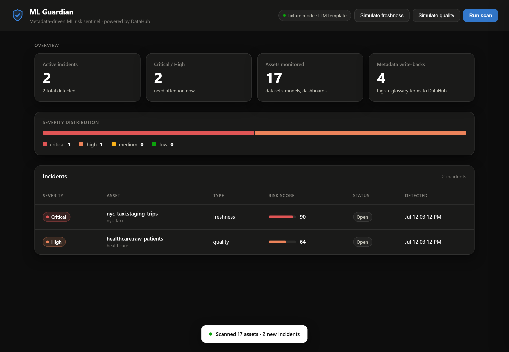
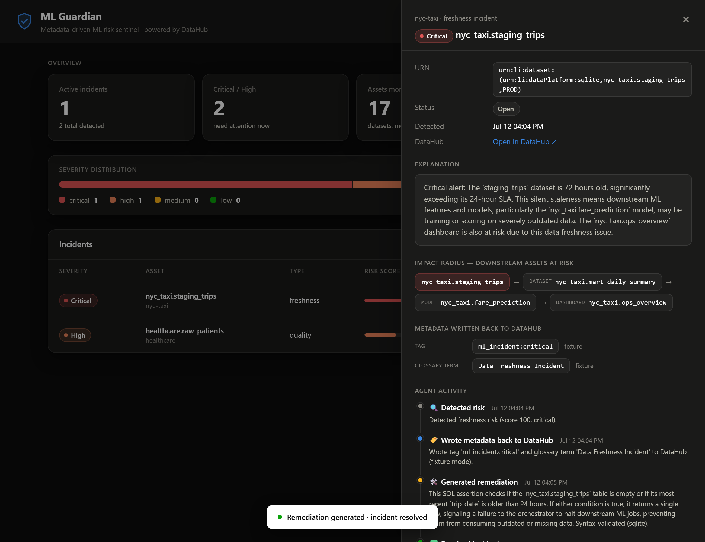
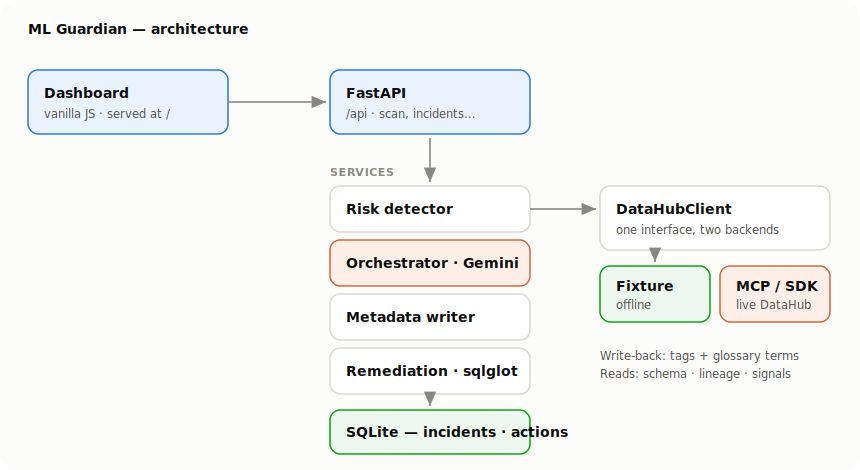

# ML Guardian: Metadata-Driven ML Risk Sentinel

[](https://github.com/rogerdemello/ml-guardian/actions/workflows/ci.yml)
[](LICENSE)

> Autonomous ML reliability agent built on DataHub's context platform.
> It monitors ML lineage, data quality, and freshness to detect silent failures,
> creates incidents, writes context back into DataHub as tags and glossary terms,
> and generates remediation code — so humans and agents inherit the knowledge.

**Build with DataHub: The Agent Hackathon** (Devpost) · Track: **Production ML Agents**
(+ Agents That Do Real Work, Metadata-Aware Code Generation).
Submission deadline: **Aug 10, 2026**.



<p align="center"><em>Incident detail — risk gauge, downstream impact radius as a lineage flow,
metadata written back to DataHub, and the agent-activity timeline.</em></p>



---

## Why this is different

Production ML fails quietly: an upstream table goes stale, a null rate creeps up,
a column is renamed — and a model keeps scoring on bad data until a KPI moves days
later. DataHub already knows how data flows from raw tables to features to models
to dashboards. ML Guardian **uses that context** to catch the problem, name the
exact downstream models/dashboards at risk, write the finding back into the graph,
and propose a fail-fast fix.

It is not a chatbot. It is a scan → score → incident → **write-back** → remediate loop.

## Runs in 60 seconds, zero infrastructure

ML Guardian is **offline-first**. Out of the box it runs against bundled fixtures
that mirror DataHub's official sample datasets (nyc-taxi, healthcare, fiction-retail)
with planted issues — no Docker, no DataHub instance, no API keys required. A single
env var (`DATAHUB_MODE=mcp`) switches it onto a live DataHub via the real
[`mcp-server-datahub`](https://pypi.org/project/mcp-server-datahub/).

**One command** runs the backend *and* the frontend (the FastAPI server serves the
dashboard — no separate Node/dev server), then opens your browser:

```bash
./run.ps1     # Windows
./run.sh      # macOS / Linux
```

It creates the venv, installs deps, and serves everything at
<http://localhost:8000>. Click **Run scan** and explore the incidents.

### Manual setup (equivalent one command)

```bash
python -m venv .venv
./.venv/Scripts/python -m pip install -r requirements.txt   # Windows path
uvicorn backend.app.main:app --port 8000                    # backend + dashboard
```

No `.env` is needed for the default offline demo. Copy `.env.example` to `.env`
only to enable a live DataHub (`DATAHUB_MODE=mcp`) or LLM explanations
(`GEMINI_API_KEY`, Google Gemini).

### The dashboard

A single-page dashboard (served at `/`, no build step) with KPI stat tiles, a
severity-distribution bar, an incidents table with inline risk-score meters, and a
slide-over detail panel showing a risk gauge, the **downstream impact radius as a
lineage flow**, the tags/glossary terms written back to DataHub, and one-click
remediation. Theme-aware (light + dark), accessible severity colors (status palette,
never color-alone).

---

## Architecture



- **DataHub client** (`backend/app/services/datahub/`) — one interface, two
  implementations: `FixtureDataHubClient` (offline, default) and `McpDataHubClient`
  (live DataHub via the SDK — see [docs/live-datahub.md](docs/live-datahub.md)).
- **Risk detector** (`risk_detector.py`) — deterministic, unit-tested heuristics for
  freshness, quality, and schema drift. **Severity is weighted by downstream ML
  impact**: a table feeding a live model/dashboard scores higher than one feeding
  nothing (impact radius from lineage).
- **Orchestrator** (`orchestrator.py`) — Google Gemini explains each incident when
  `GEMINI_API_KEY` is set; falls back to templates so it always runs.
- **Metadata writer** (`metadata_writer.py`) — writes `ml_incident:<severity>` tags
  and incident glossary terms back to DataHub. Offline, these are recorded in
  `writeback_log.json` + the `datahub_writebacks` table as visible proof.
- **Remediation** (`remediation.py`) — generates **dialect-aware, `sqlglot`-validated**
  SQL assertions grounded in the asset's real schema and SLA; artifacts land in
  `examples/generated/`.
- **Agent activity** — every step (detect → write-back → generate → resolve) is
  recorded as an `AgentAction` and surfaced as a timeline in the incident drawer.

## DataHub integration

**Offline (`fixture`)** — bundled fixtures mirror the real sample datasets so the
whole detect → score → write-back → remediate loop runs with no infra.

**Live (`DATAHUB_MODE=mcp`)** — `McpDataHubClient` uses the DataHub Python SDK
(`acryl-datahub`): reads schema/lineage via `DataHubGraph`, derives freshness from
the `operation` aspect, and does a real **read-modify-write** of the `globalTags` /
`glossaryTerms` aspects (`emit_mcp`) — the same tag + glossary-term write-back the
fixture mode simulates. Setup: [docs/live-datahub.md](docs/live-datahub.md).

## API

All under `/api`:

| Method | Path | Purpose |
|--------|------|---------|
| GET  | `/api/health` | mode + LLM status |
| POST | `/api/scan` | detect, persist, write back, explain |
| GET  | `/api/incidents` | list (filter `severity`, `status`) |
| GET  | `/api/incidents/{id}` | detail: impact radius, write-backs, remediation |
| POST | `/api/incidents/{id}/apply-remediation` | generate artifact + resolve |
| GET  | `/api/risk-scores` | current scores per asset |
| POST | `/api/simulate-issue` | worsen a signal then re-scan (fixture mode) |

## Data model (SQLite)

`ml_incidents`, `risk_scores`, `agent_actions`, `datahub_writebacks`. Assets and
lineage stay in DataHub, referenced by URN.

## Tests

```bash
./.venv/Scripts/python -m pytest backend/tests -q
```

Covers the detector heuristics and a full fixture-mode API flow
(scan → incident → write-back → remediation), 9 tests, no external services.

## Open-source contribution

`skills/datahub-ml-guardian/` is a reusable DataHub **Skill** in the registry format
(`SKILL.md` + `references/` + `templates/`), so any DataHub agent tool (Gemini CLI,
Claude Code, Cursor, etc.) can run the same detect → write-back → remediate workflow.

## Repository layout

```
backend/app/        FastAPI app, services, fixtures, prompts
backend/tests/      pytest (detector + API e2e)
frontend/           static dashboard (no build step)
skills/datahub-ml-guardian/   reusable DataHub Skill
examples/           sample remediation artifacts + write-back
DOCS_HACKATHON.md   judge guide
```

## License

Apache 2.0 — see `LICENSE`.
